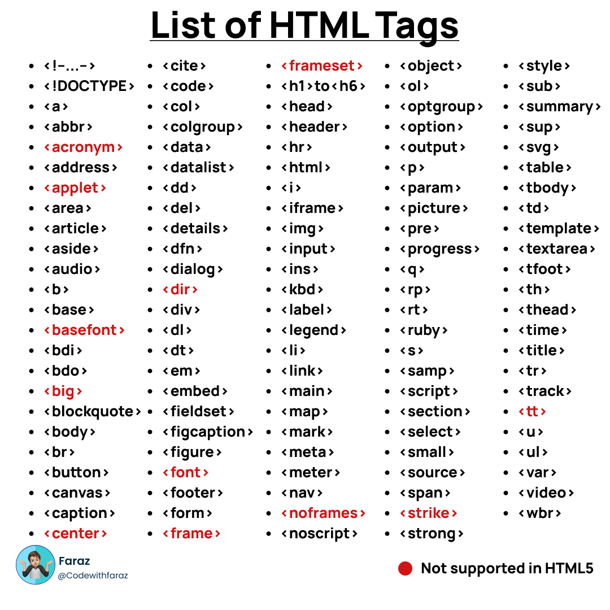

# Lesson 5

## DOM (Document Object Model)

```
<option>United States</option>

--> thẻ mở: <option>
--> thẻ đóng </option>
```

```
<option value="usa">United States</option>

--> thẻ mở: <option value="usa">
--> thẻ đóng: </option>
--> thuộc tính: value
--> giá trị thuộc tính: "usa"
--> text: United States
```

```

<br>

--> thẻ tự đóng: 
```

Các thẻ HTML thường gặp:

```
- Thẻ <div> (viết tắt của divide): dùng để chia các khối trong trang web
- Thẻ <h1></h1> đến <h6></h6> (viết tắt của heading): dùng để tạo ra các header phân cấp
theo thứ tự từ lớn đến bé.
- Thẻ <form></form>: dùng để chứa một form thông tin.
- Thẻ input: text, email, radio, checkbox, file, color, range, date
- Thẻ textarea: hiển thị ô input, dạng to.
- Thẻ radio button: tạo nút chọn một (radio).
- Thẻ checkbox: tạo nút chọn nhiều lựa chọn (checkbox).
- Thẻ list và dropdown: hiển thị danh sách hoặc menu thả xuống.
- Thẻ button: tạo nút bấm.
- Thẻ table: hiển thị bảng dữ liệu.
- thead = table heading
- tr = table row = 1 dòng
- th: table heading: text in đậm

- tbody
- tr -> td = table data
- Thẻ date picker: tạo bộ chọn ngày.
- Thẻ slider: tạo thanh trượt.
- Thẻ iframe: hiển thị nội dung từ một trang web khác bên trong trang hiện tại.
```

## Selector
- XPath = XML Path

```
- Có 2 loại:
○ Tuyệt đối: đi dọc theo cây DOM
■ bắt đầu bởi 1 /
○ Tương đối: tìm dựa vào đặc tính
■ bắt đầu bởi 2 //
■ //tenthe[@thuoctinh="gia tri"]
○ Nên dùng XPath tương đối
```
```
ví dụ: 
<input type="text" id="username" name="username" required="">

//input[@id="username"]
```
## Playwright basic syntax
### test
- Đơn vị cơ bản để khai báo một test
```
import { test } from '@playwright/test';

test('<tên test>', async ({ page }) => {
// Code của test
});
```
### step
- Đơn vị nhỏ hơn test, để khai báo từng step của test case

```
await test.step('Tên step', async () => {
// Code here
});
```

- **Lưu ý**: step nên được map 1-1 với test case để dễ dàng maintain

```
await test.step('Tên step', async () => {
// Code here
});
------

test('<tên test>', async ({ page }) => {
await test.step('Tên step', async () => {
// Code here
});
});
```
### Basic actions
- **Navigate**
```
await page.goto('https://pw-practice.playwrightvn.com/');
```

- **Click**

- Single click
```
await page.locator("//button").click();
```
- Double click
```
await page.locator("//button").dblclick();
```
- Click chuột phải
```
page.locator("//button").click({
button: 'right'
})
```
- Click chuột kèm bấm phím khác
```
page.locator("").click({
modifiers: ['Shift'],
})
```
- **Input**
- fill: Giống việc bạn paste content vào một ô input
```
page.locator("//input").fill('Playwright Viet Nam');

--> nên dùng fill để nhanh hơn
```

- pressSequentially: Giống việc bạn gõ từng chữ cái vào ô input
```
page.locator("//input").pressSequentially('Playwright
Viet Nam', {
delay: 100,
});
```
- **Radio/checkbox**
- Lấy giá trị hiện tại đang là check hay không
```
const isChecked =
page.locator("//input").isChecked();
```
- Check/ uncheck
```
page.locator("//input").check();
page.locator("//input").setChecked(false);
```

- **Select Option**
```
page.locator("//oselect[@id="country"]).selectOption({value: "usa});
```
- **Set Input File**
```
page.locator("//input[@id="profile"]).setInputFiles('(đường dẫn)')
```